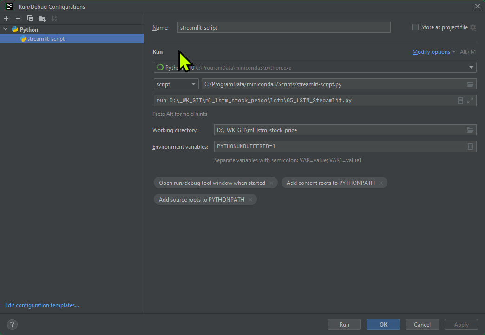
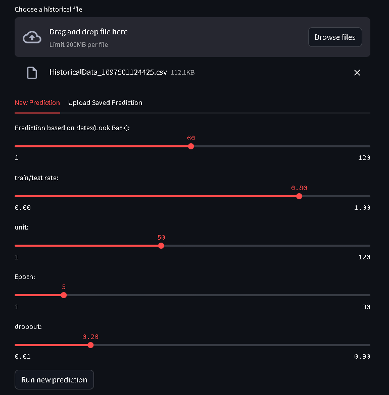

# ml-lstm-stock-price

Where to download latest historical data:
    https://www.nasdaq.com/market-activity/quotes/historical

How to launch the streamlit:

1. GUI
    

2. CLI:
    ```
    streamlit run PATH/05_LSTM_Streamlit.py
    ```

How to train model:



Use saved prediction:


